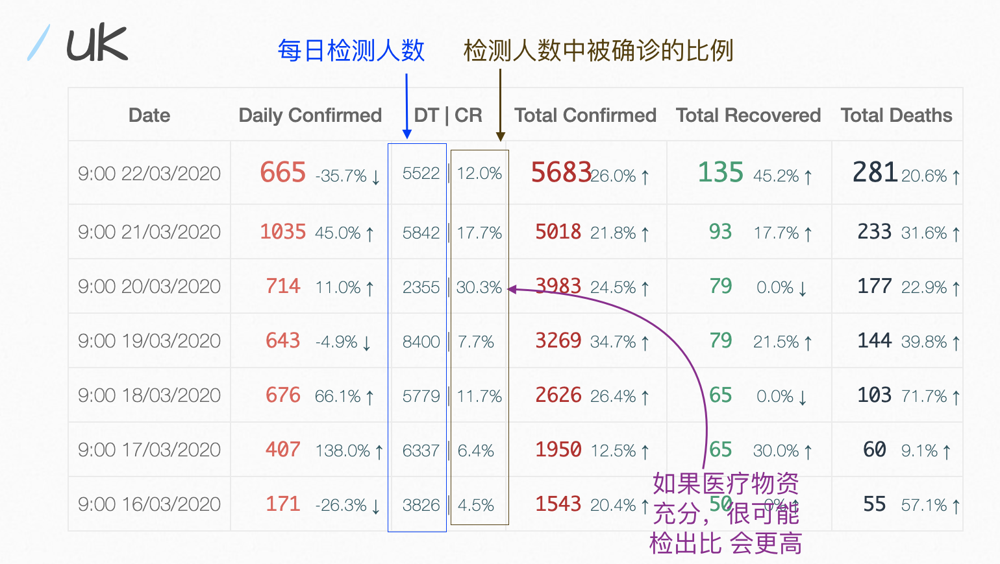

# COVID-19-UK

This project focuses on tracking the trend of coronavirus spreading in UK in order to better help people protect themselves.

The website [https://xshaun.github.io/covid-19-uk/](https://xshaun.github.io/covid-19-uk/) provides data visualization as follows.

Everyone, no matter from academics or industries, can access and (re-)process these data freely, but must follow the policies of [www.gov.uk](www.gov.uk) and local goverments. `Don't be evil !!`

***Welcome everyone to join this project***. 